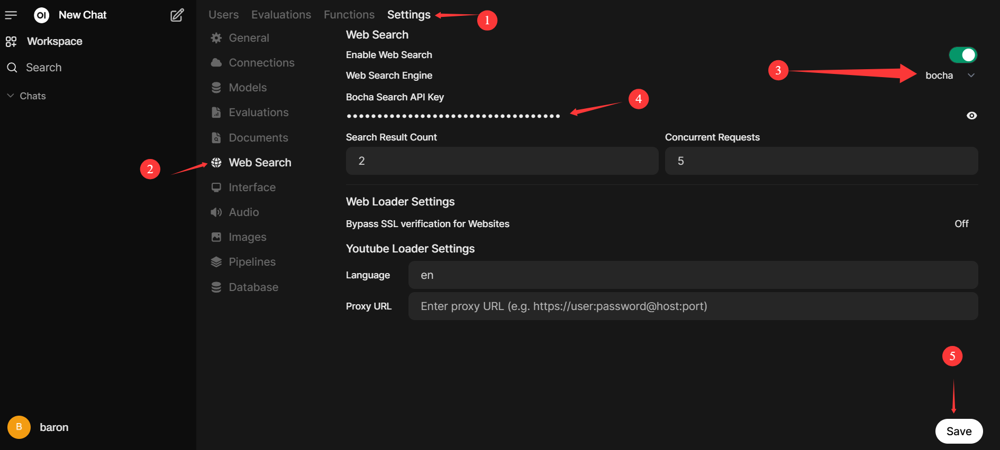

# Open WebUI With Bocha 👋

**Open WebUI is an [extensible](https://github.com/open-webui/open-webui?tab=readme-ov-file), feature-rich, and user-friendly self-hosted AI platform designed to operate entirely offline.** It supports various LLM runners like **Ollama** and **OpenAI-compatible APIs**, with **built-in inference engine** for RAG, making it a **powerful AI deployment solution**.

We modified the Open WebUI code to support the Bocha search API.

## How to Install 🚀

### Install Ollama

Please refer to the [ollama installation document](https://ollama.readthedocs.io/en/quickstart/) for details and install the models you need.

### Install Open-WebUI

Before proceeding, ensure you're using **Python 3.11** to avoid compatibility issues.

1. :

   ```bash
   git clone https://github.com/luckyman-yan/ollama_webui_with_bocha.git
   cd ollama_webui_with_bocha/
   ```

2. **Copying required .env file**:

   ```bash
   cp -RPp .env.example .env
   ```

3. **Serving Frontend with the Backend**:

   ```bash
   cd ./backend
   pip install -i https://pypi.tuna.tsinghua.edu.cn/simple -r requirements.txt -U
   ```

4. **Building Frontend Using Node**:

   ```bash
   npm i
   npm run build
   ```

## Start the Open WebUI server

  Linux:

   ```bash
   cd ./backend
   bash start.sh
   ```

  Windows:
   ```bash
   cd ./backend
   start_windows.bat
   ```  

This will start the Open WebUI server, which you can access at [http://localhost:8080](http://localhost:8080).

You need to set your account and password as administrator information when you use it for the first time. Then you can start using the service.


## Open web search

To access Web Search, Click on the + next to the message input field.

Here you can toggle Web Search On/Off. 


If you want to change the search engine, let's change it to Bocha as an example.
1. Navigate to Admin Panel -> Settings -> Web Search
2. Toggle Enable Web Search
3. Set Web Search Engine from dropdown menu to Bocha
4. Fill Mojeek Search API Key with the API key
5. Click Save

